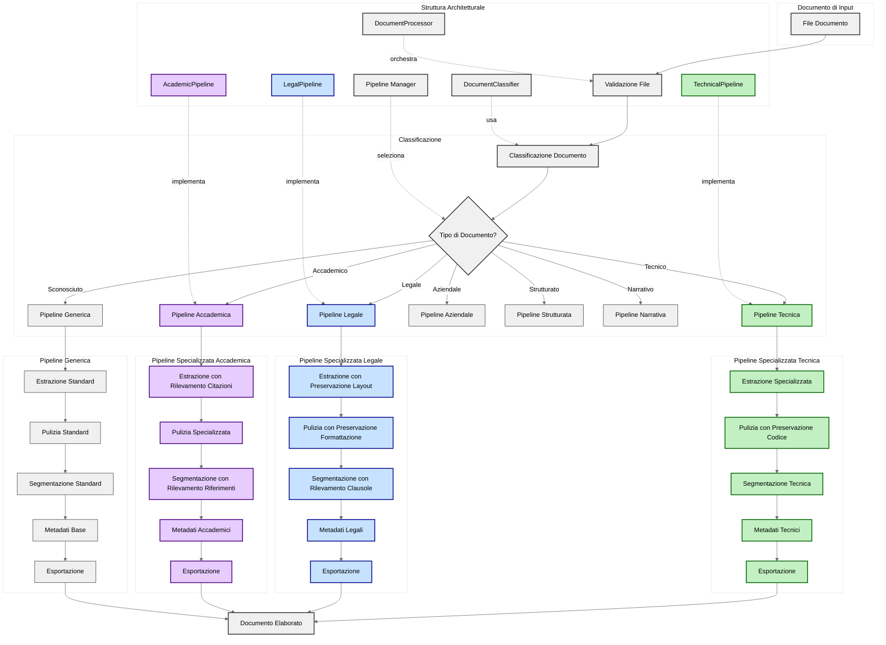

```mermaid
%%{init: { 'theme': 'base', 'themeVariables': { 'primaryColor': '#f0f0f0', 'primaryTextColor': '#000', 'primaryBorderColor': '#333', 'lineColor': '#666', 'secondaryColor': '#fafafa', 'tertiaryColor': '#fff' } } }%%
flowchart TD
    subgraph "Documento di Input"
        A[File Documento]
    end

    A --> B[Validazione File]
    B --> C[Classificazione Documento]
    
    subgraph "Classificazione"
        C --> D{Tipo di Documento?}
        D -->|Tecnico| E1[Pipeline Tecnica]
        D -->|Legale| E2[Pipeline Legale]
        D -->|Accademico| E3[Pipeline Accademica]
        D -->|Aziendale| E4[Pipeline Aziendale]
        D -->|Strutturato| E5[Pipeline Strutturata]
        D -->|Narrativo| E6[Pipeline Narrativa]
        D -->|Sconosciuto| E7[Pipeline Generica]
    end
    
    subgraph "Pipeline Specializzata Tecnica"
        E1 --> F1[Estrazione Specializzata]
        F1 --> G1[Pulizia con Preservazione Codice]
        G1 --> H1[Segmentazione Tecnica]
        H1 --> I1[Metadati Tecnici]
        I1 --> J1[Esportazione]
    end
    
    subgraph "Pipeline Specializzata Legale"
        E2 --> F2[Estrazione con Preservazione Layout]
        F2 --> G2[Pulizia con Preservazione Formattazione]
        G2 --> H2[Segmentazione con Rilevamento Clausole]
        H2 --> I2[Metadati Legali]
        I2 --> J2[Esportazione]
    end
    
    subgraph "Pipeline Specializzata Accademica"
        E3 --> F3[Estrazione con Rilevamento Citazioni]
        F3 --> G3[Pulizia Specializzata]
        G3 --> H3[Segmentazione con Rilevamento Riferimenti]
        H3 --> I3[Metadati Accademici]
        I3 --> J3[Esportazione]
    end
    
    subgraph "Pipeline Generica"
        E7 --> F7[Estrazione Standard]
        F7 --> G7[Pulizia Standard]
        G7 --> H7[Segmentazione Standard]
        H7 --> I7[Metadati Base]
        I7 --> J7[Esportazione]
    end
    
    J1 --> K[Documento Elaborato]
    J2 --> K
    J3 --> K
    J7 --> K
    
    subgraph "Struttura Architetturale"
        L[DocumentClassifier] -.-> |usa| C
        M[Pipeline Manager] -.-> |seleziona| D
        N[TechnicalPipeline] -.-> |implementa| E1
        O[LegalPipeline] -.-> |implementa| E2
        P[AcademicPipeline] -.-> |implementa| E3
        Q[DocumentProcessor] -.-> |orchestra| B
    end

    classDef generic fill:#f0f0f0,stroke:#333,stroke-width:2px;
    classDef technical fill:#c2f0c2,stroke:#006400,stroke-width:2px;
    classDef legal fill:#c6e2ff,stroke:#00008b,stroke-width:2px;
    classDef academic fill:#e6ccff,stroke:#4b0082,stroke-width:2px;
    classDef business fill:#ffd700,stroke:#b8860b,stroke-width:2px;
    classDef narrative fill:#ffb6c1,stroke:#8b0000,stroke-width:2px;
    
    class A,B,C,D,K,L,M,Q generic;
    class E1,F1,G1,H1,I1,J1,N technical;
    class E2,F2,G2,H2,I2,J2,O legal;
    class E3,F3,G3,H3,I3,J3,P academic;
```